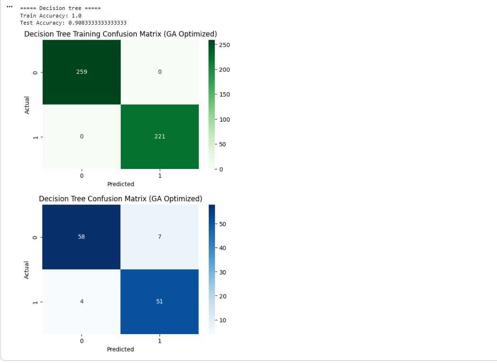

 Heart Disease Prediction using Stacking Ensemble and Genetic Algorithm

Project Overview

Heart disease is one of the leading causes of death worldwide. Early detection can significantly improve treatment outcomes and save lives.

This project develops a machine learning model to predict whether a patient has heart disease based on clinical attributes. Multiple machine learning algorithms are trained and compared, and a Stacking Ensemble model optimized using a Genetic Algorithm is used to improve prediction performance.


 Objectives

- Predict the presence of heart disease using patient clinical data.
- Compare the performance of multiple machine learning algorithms.
- Improve classification accuracy using a Stacking Ensemble model.
- Optimize model performance using a Genetic Algorithm.
- Evaluate models using various performance metrics.


Dataset

**Dataset:** Cleveland Heart Disease Dataset

The dataset contains patient medical information including:

- Age
- Sex
- Chest Pain Type
- Resting Blood Pressure
- Cholesterol
- Fasting Blood Sugar
- Resting ECG
- Maximum Heart Rate
- Exercise Induced Angina
- Oldpeak
- ST Slope
- Number of Major Vessels
- Thalassemia
- Target (Heart Disease)

Dataset Location:

```
dataset/
└── cleveland combined.csv
```

---
 Technologies Used

- Python
- Google Colab
- Pandas
- NumPy
- Matplotlib
- Seaborn
- Scikit-learn
- XGBoost
- DEAP (Genetic Algorithm)

---

 Machine Learning Models

The following models were implemented and evaluated:

- Decision Tree
- Random Forest
- Support Vector Machine (SVM)
- XGBoost
- Stacking Ensemble

 Meta Learner

- XGBoost Classifier

 Hyperparameter Optimization

- Genetic Algorithm (GA)

---

 Project Workflow

1. Data Collection
2. Data Cleaning
3. Missing Value Handling
4. Feature Scaling
5. Train-Test Split
6. Model Training
7. Genetic Algorithm Optimization
8. Stacking Ensemble
9. Performance Evaluation
10. Result Visualization

---

 Performance Metrics

The models are evaluated using:

- Accuracy
- Precision
- Recall
- F1-Score
- Matthews Correlation Coefficient (MCC)
- Confusion Matrix

---

 Project Screenshots

### Workflow


### Correlation Heatmap


### SVM Confusion Matrix


### Decision Tree Confusion Matrix



### Random Forest Confusion Matrix


### Stacking Ensemble Confusion Matrix


---

## 📁 Repository Structure

```
Heart-Disease-Prediction/
│
├── README.md
├── heart disease prediction.ipynb
│
├── dataset/
│   └── cleveland combined.csv
│
├── images/
│   ├── workflow.png
│   ├── heatmap.png
│   ├── svm.png
│   ├── randomforest.png
│   ├── confusion_matrix_decisiontree.png
│   ├── stacking.png
│   └── ...
```

---

 How to Run the Project

### Clone the Repository

```bash
git clone https://github.com/sabapathy-c/Heart-Disease-Prediction.git
```

 Install Required Libraries

```bash
pip install -r requirements.txt
```

### Open Notebook

Launch Jupyter Notebook or Google Colab and open:

```
heart disease prediction.ipynb
```

Run all cells sequentially.


 Results

The Stacking Ensemble model optimized using a Genetic Algorithm achieved higher predictive performance compared to individual machine learning models, demonstrating improved classification capability for heart disease prediction.


 Future Improvements

- Deploy the model using Streamlit or Flask.
- Add real-time prediction capability.
- Integrate additional healthcare datasets.
- Perform advanced feature engineering.
- Explore deep learning approaches.


 Author

Sabapathy C
